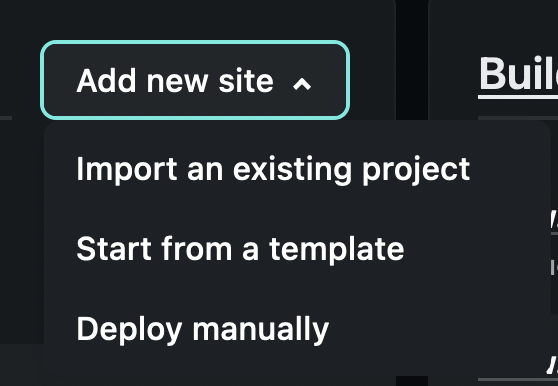

# Deployment

Instructions on how to deploy a React Frontend with React Router to [Netlify](https://www.netlify.com/)

## Prepare your frontend for 

- Add a `config.js` to `client/src` and add the following code:

  ```js
  const DEV_API_URL = "http://localhost:4000"
  const PROD_API_URL = process.env.REACT_APP_API_URL
  export const API_URL =
    process.env.NODE_ENV === "production" ? PROD_API_URL : DEV_API_URL
  ```

* To your `.env` file add the following - replacing with your own backend URL.

```
REACT_APP_PROD_URL=myherokubackendurl.herokuapp.com/api
```

## Create new site in Netlify

1. Go to your netlify dashboard
2. Click on **Add new site** > **Import an existing project**

  

## Connect your GitHub repository

Choose **GitHub** -> **Choose your repository**

- The `main` branch will be selected automatically

Fill out the following fields like so

- **Base directory**: Leave blank
- **Build command**: `npm run build`
- **Publish directory**: `build`

## Ensure the React Router works

To allow React router to work properly, do the following:

1. In the `public` folder add a file called `_redirects` with the content:

  ```
  /*    /index.html   200
  ```

2. Commit and push this code -> This should trigger a redirect.

**Note**: If this is done wrong you'll get `404` errors when routing to routes different from `/`.

## Troubleshooting

If a deploy fails, check out the build logs first! To see the logs, just lick on the failed deploy

### If your deployment fails and you see the following in the deployment logs:

```
Treating warnings as errors because process.env.CI = true
```

In the Netlify dashboard go to `Deploys` -> `Deploy Settings`

There you will see `Environment` tab > `Edit Variables`

**Key**: `CI`
**Value**: `False`

Hit `save`.

Now **re-deploy**. To redeploy your site, do one of the following:

- On your site dashboard, click on `Trigger deploy` > `Deploy site` 
- Make a change to your code, commit and push it to the `main` branch.

## Test in `Postman` or `Insomnia`

If you make API calls in `Postman` or `Insomnia`, replace `http://localhost:8000` with your new heroku URL.